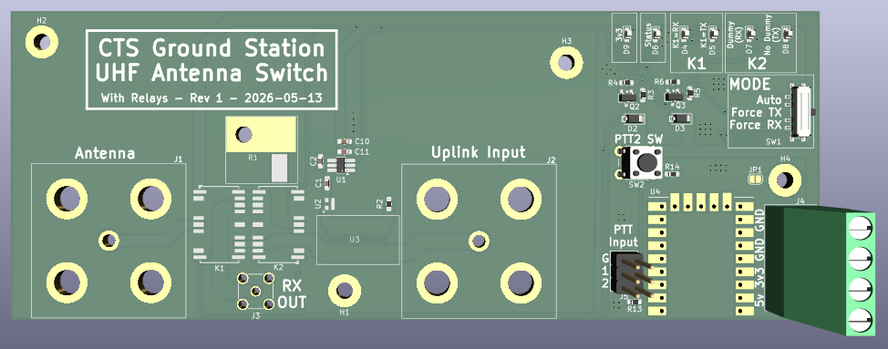

# CTS-Ground-Station-UHF-Antenna-Switch

PCB and firmware for a ground station UHF antenna switch (between high-power uplink and low-noise downlink, via a single antenna).

This is a high-power UHF antenna switch PCB (for separate RX/TX paths), controlled with automatic TX sensing.

## Render

See the Releases for schematics, gerbers, and BOM.

## Features

* High Power: Supports TX power of >45 dBm (>30 W)
* Low insertion loss
* Easy-to-deploy (automatic carrier sensing on the TX line)
* Shunt-to-GND: Avoids damage to the transmitter by avoiding reflecting any power back on the TX port, in case of switching latency or failure. Dissipates as heat through a dummy load.
* LED indicators.
* Uses RF relays for switching. Simple design and power supply requirements (compared to PIN Diode approach).
* Optional slide switch to override control modes.

## Key Components

* RF Relay: `1462051-1` (HF3-1 with 3V control)
* Dummy Load Resistor: `I100N50X4B`
* RF Attenuator (10 dB): `PAT1220-C-10DB-T5`
* RF Detector: `LTC5507ES6`
* Microcontroller: RP2040-Zero PCB

## License

**Hardware Parts:** CERN Open Hardware Licence Version 2 - Permissive
